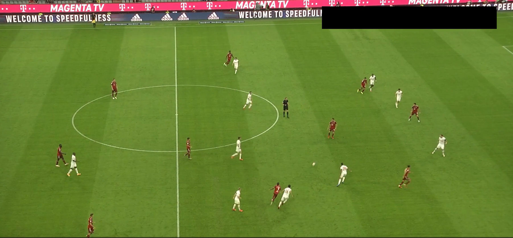
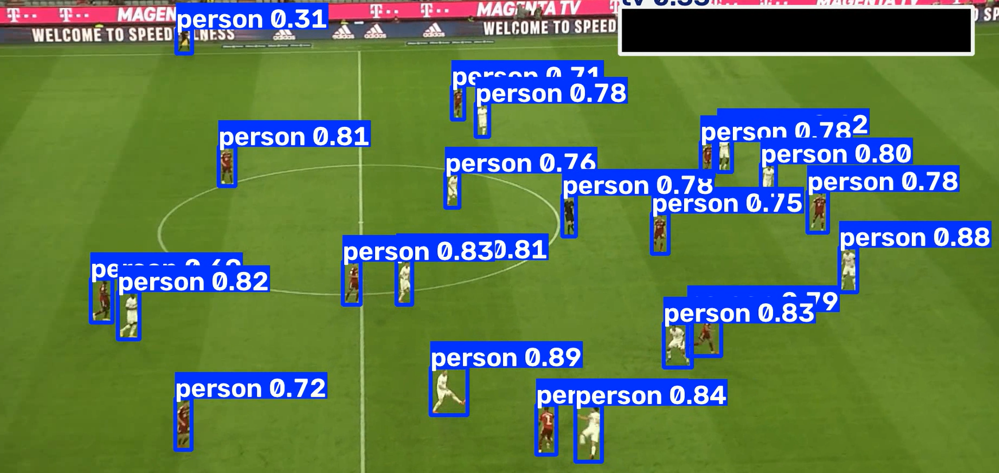
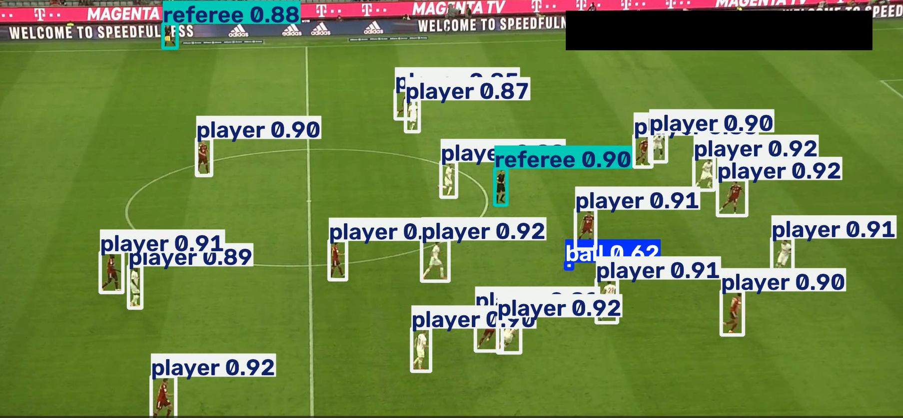

# Football Match Analyser

**An experimental computer vision pipeline for automated football match analysis, using YOLO-based object detection fine-tuned on football-specific imagery.**

---

## Abstract

General-purpose object detectors are reasonably effective at locating people in unconstrained video, but they perform poorly on small, fast-moving objects such as a football in broadcast-style match footage. This project investigates whether **domain-specific fine-tuning** of a YOLO detector can close that gap. A baseline `YOLOv8x` model is compared against a `YOLOv5x` detector fine-tuned on an annotated football dataset covering four object classes: `ball`, `goalkeeper`, `player`, and `referee`. The current repository implements the detection pipeline and a qualitative before/after comparison; it is designed as a foundation for a full match-analysis system (tracking, tactical statistics, and possession analysis) rather than a finished product.

---

## 1. Motivation

Football match analysis is a natural computer vision application: broadcast footage is abundant, object classes are well-defined, and downstream applications (tactical analysis, automated highlights, performance analytics) have clear practical value. However, an initial trial with an off-the-shelf pretrained detector revealed a specific weakness — **players were detected reliably, but the ball was detected inconsistently or missed entirely**. This is expected: the ball occupies a very small number of pixels relative to the frame, is frequently occluded, and moves quickly enough to introduce motion blur.

This motivated a targeted experiment: fine-tune a YOLO model on football-specific annotations and evaluate whether ball detection improves, without materially degrading detection of the other classes.

### Object Classes

| Class | Description |
|---|---|
| `ball` | The football. Smallest class by pixel area; most sensitive to resolution, angle, and occlusion. |
| `goalkeeper` | A goalkeeper, visually distinct from outfield players (kit, positioning). |
| `player` | An outfield player. |
| `referee` | A match official. |

---

## 2. Method

### 2.1 Detection Pipeline

The current implementation is a single-pass, frame-by-frame object detection pipeline:

```text
Match video (.mp4)
        │
        ▼
 YOLO model (baseline or fine-tuned)
        │
        ▼
Bounding boxes + class predictions per frame
        │
        ▼
Annotated video written by Ultralytics
```

Two inference scripts allow direct comparison between the baseline and fine-tuned detectors:

| Script | Model | Purpose |
|---|---|---|
| `yolo_infernce_before_training.py` | `yolov8x` (COCO-pretrained) | Baseline reference |
| `yolo_infernce_after_training.py` | Fine-tuned weights (`models/best.pt`) | Football-specific detector |

Both scripts read from `input_video/video.mp4` and call Ultralytics with `save=True`, which writes annotated predictions to an auto-generated `runs/detect/predict*` directory.

### 2.2 Training Configuration

The fine-tuned model is trained with:

```bash
yolo task=detect mode=train model=yolov5x.pt data=<dataset-location>/data.yaml epochs=100 imgsz=640
```

Training is documented in full in [`training/readme.md`](training/readme.md), with both a local notebook (`training/football_training_yolo_v5_local.ipynb`) and a Google Colab notebook (`training/football_training_yolo_v5_colab.ipynb`) for users without local GPU access. The best checkpoint (`weights/best.pt`) is copied to `models/best.pt` for use by the inference script.

### 2.3 Data

| Purpose | Source | License |
|---|---|---|
| Match footage (inference input) | [DFL Bundesliga 460 (Kaggle)](https://www.kaggle.com/datasets/saberghaderi/-dfl-bundesliga-460-mp4-videos-in-30sec-csv) | Per Kaggle dataset terms |
| Training annotations | [Football Players Detection v1 (Roboflow)](https://universe.roboflow.com/roboflow-jvuqo/football-players-detection-3zvbc) | CC BY 4.0 — attribution required on redistribution |

Annotations follow the standard YOLO format (one object per line, normalized coordinates):

```text
class_id center_x center_y width height
```

Expected dataset layout:

```text
football-players-detection-1/
├── data.yaml
└── football-players-detection-1/
    ├── train/  {images/, labels/}
    ├── valid/  {images/, labels/}
    └── test/   {images/, labels/}
```

---

## 3. Results

### 3.1 Qualitative Comparison

| Input | Baseline (`yolov8x`) | Fine-tuned (`yolov5x`) |
|---|---|---|
|  |  |  |

The baseline model detects players consistently but rarely detects the ball. The fine-tuned model, trained on football-specific annotations for all four classes, shows visibly more consistent ball detection in the same footage.

> **Note:** this comparison is currently qualitative only. A numeric baseline-vs-fine-tuned benchmark (e.g., per-class AP, ball-specific recall) is a planned addition — see [Limitations](#5-limitations-and-future-work).

### 3.2 Training Diagnostics

| Loss Curves | Mean Average Precision (mAP) |
|---|---|
|  |  |

| Precision / Recall | Per-Class Performance |
|---|---|
|  |  |

The per-class breakdown is the most diagnostically useful chart in this project: it isolates whether the ball — the hardest class — is converging at a different rate than the larger, easier classes (player, goalkeeper, referee).

---

## 4. Repository Structure

```text
.
├── main.py                              # Placeholder application entry point
├── yolo_infernce_before_training.py     # Baseline inference (yolov8x)
├── yolo_infernce_after_training.py      # Fine-tuned inference
├── requirement.txt                      # Python dependencies
├── yolov8x.pt                           # Baseline weights (when provided)
├── input_video/
│   └── video.mp4                        # Expected input video
├── assets/                              # README reference images
├── runs/detect/predict*/                # Ultralytics prediction outputs
└── training/
    ├── readme.md                        # Full training documentation
    ├── football_training_yolo_v5_local.ipynb
    ├── football_training_yolo_v5_colab.ipynb
    ├── assets/                          # Training metric charts
    └── football-players-detection-1/   # Dataset (downloaded)
```

---

## 5. Getting Started

### Requirements

- Python 3.8+
- CUDA-enabled PyTorch recommended for training and fast inference (CPU inference is supported but slower)
- Input video present at `input_video/video.mp4`

### Installation

```bash
pip install -r requirement.txt
```

### Running Inference

```bash
# Baseline detector
python yolo_infernce_before_training.py

# Fine-tuned detector (requires models/best.pt)
python yolo_infernce_after_training.py
```

Each script prints the first prediction result and its bounding boxes to the terminal, and writes the annotated video under `runs/detect/`.

### Troubleshooting

| Issue | Resolution |
|---|---|
| `Input video not found` | Confirm `input_video/video.mp4` exists |
| Fine-tuned weights fail to load | Confirm `models/best.pt` exists and is a valid Ultralytics checkpoint |
| No prediction video produced | Check terminal for codec/model errors; inspect `runs/detect/predict*/` |
| CUDA out-of-memory | Run on CPU, reduce batch/model size, or train via Colab |
| Duplicated training paths | Rerun the dataset path-fixing cell in the training notebook |
| Ball still missed after fine-tuning | Review per-class precision/recall; consider higher-resolution footage or additional annotated frames |

---

## 6. Limitations and Future Work

The project currently addresses **detection only**, on a single-video, single-pass basis. It does not yet implement:

- Persistent multi-frame object tracking (e.g., ByteTrack/DeepSORT) for consistent player identities across frames
- Team classification (e.g., via jersey color clustering)
- Ball possession, trajectory reconstruction, or tactical/statistical outputs
- A quantitative baseline-vs-fine-tuned benchmark (per-class AP/recall table)
- A configurable command-line interface (input/output paths, model selection)
- A complete application entry point (`main.py` is currently a placeholder)

These form a natural roadmap: detection → tracking → identity/team assignment → tactical and statistical analysis.

---

## 7. Data Sources and Attribution

- Match footage: [DFL Bundesliga 460 — Kaggle](https://www.kaggle.com/datasets/saberghaderi/-dfl-bundesliga-460-mp4-videos-in-30sec-csv)
- Training annotations: [Football Players Detection v1 — Roboflow](https://universe.roboflow.com/roboflow-jvuqo/football-players-detection-3zvbc), CC BY 4.0

If you reuse or redistribute the Roboflow dataset, retain attribution per its license terms.

---

## License

This project's code is released under the [MIT License](LICENSE).

Note that the training dataset ([Football Players Detection v1](https://universe.roboflow.com/roboflow-jvuqo/football-players-detection-3zvbc)) is licensed separately under **CC BY 4.0** and retains its own attribution requirements independent of this repository's license.