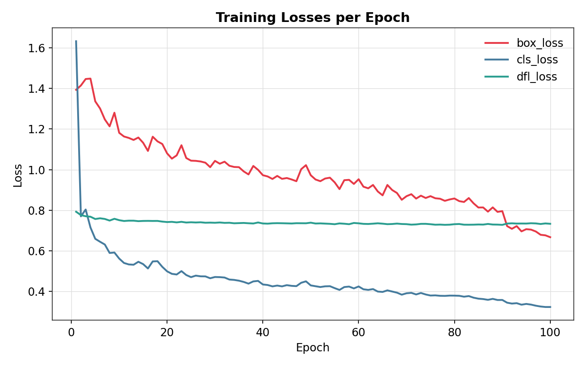
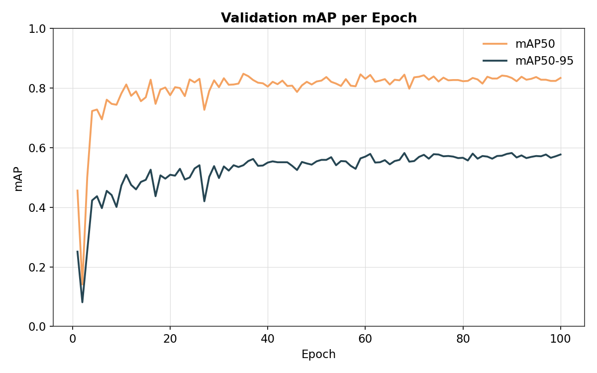
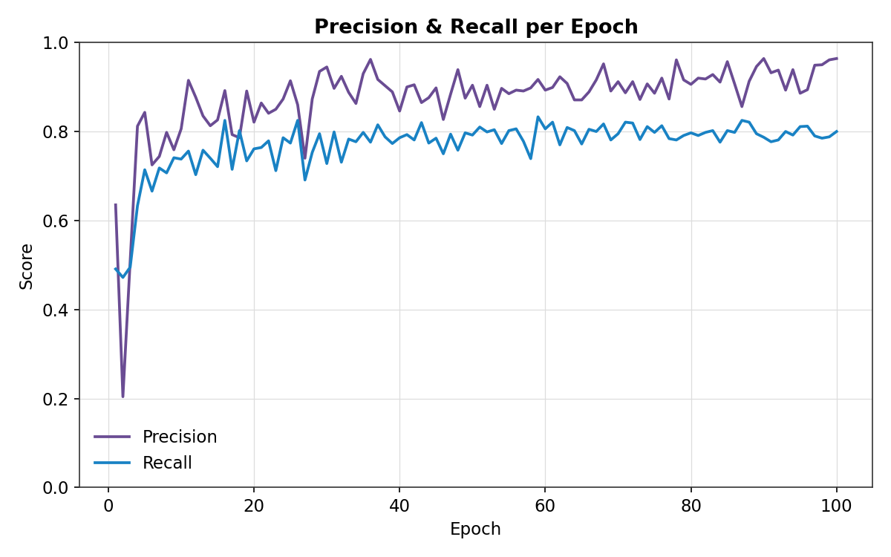
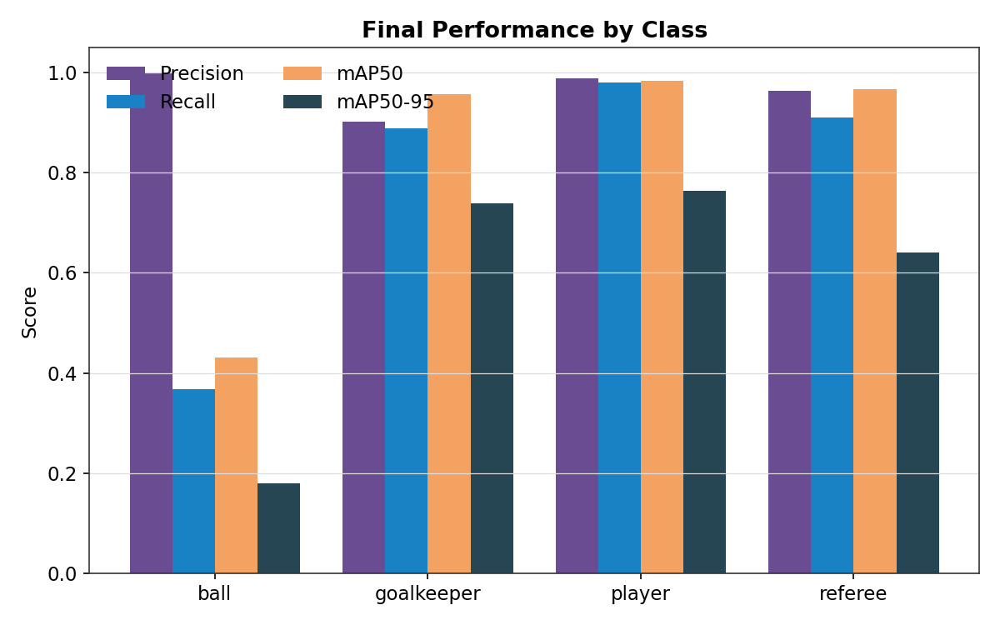

# Football Detection Model Training

This folder contains the training workflow for improving the football object detector used by the match analyser. The project started with a general YOLO model, which could detect people in match footage but detected the ball inconsistently. The training notebooks use a football-specific Roboflow dataset to improve detection of players, goalkeepers, referees, and the ball.

## What Is Included

| Path | Purpose |
| --- | --- |
| `football_training_yolo_v5_local.ipynb` | Run the complete workflow locally on a machine with sufficient compute. |
| `football_training_yolo_v5_colab.ipynb` | Run the workflow in Google Colab when local hardware is not powerful enough. |
| `football-players-detection-1/` | Downloaded YOLOv5-format dataset and annotations. |
| `football-players-detection-1/data.yaml` | Dataset configuration containing the four class names and split paths. |

## Training Workflow

Both notebooks follow the same process:

1. Install `ultralytics` and `roboflow`.
2. Download version 1 of the [Football Players Detection dataset](https://universe.roboflow.com/roboflow-jvuqo/football-players-detection-3zvbc) from Roboflow.
3. Locate the `train`, `valid`, and `test` image folders, even when Roboflow nests them differently.
4. Rewrite `data.yaml` with the discovered absolute paths so YOLO does not concatenate duplicated paths.
5. Train a `yolov5x` detector for 100 epochs with an image size of 640.

The training command used by the notebooks is:

```bash
yolo task=detect mode=train model=yolov5x.pt data=<dataset-location>/data.yaml epochs=100 imgsz=640
```

Training results are normally written by Ultralytics under a `runs/detect/` directory. Keep the best trained weights, usually `weights/best.pt`, and use that file for inference in the main project.

## Training Results

| Losses | mAP |
| --- | --- |
|  |  |

| Precision/Recall | Per-Class Performance |
| --- | --- |
|  |  |

## Dataset Classes

The model is trained to detect four classes:

| Class | Meaning |
| --- | --- |
| `ball` | The football. |
| `goalkeeper` | A goalkeeper. |
| `player` | An outfield player. |
| `referee` | A match official. |

The dataset is published under the `CC BY 4.0` license. See the dataset page for its attribution requirements.

## Option A: Local Training

Use the local notebook when the computer has enough GPU memory and processing power for `yolov5x` training.

1. Open `football_training_yolo_v5_local.ipynb` in VS Code or Jupyter.
2. Install the notebook dependencies when prompted.
3. Create a `.env` file in the project root and add your Roboflow key:

   ```env
   api_key_robflow=your_roboflow_api_key
   ```

4. Run the notebook cells from top to bottom.
5. Check the printed dataset paths before starting training.
6. Copy the resulting `best.pt` weights into the location expected by the inference script.

The local notebook reads the key with `python-dotenv`, so the key stays outside the notebook and should not be committed to Git.

## Option B: Google Colab

Use the Colab notebook when local hardware is not suitable for training.

1. Open `football_training_yolo_v5_colab.ipynb` in Google Colab.
2. Run the installation and dataset download cells.
3. Provide your Roboflow API key in the download cell, or preferably load it through Colab Secrets.
4. Run the dataset inspection and path-fixing cells.
5. Confirm that both `train` and `valid` folders were found.
6. Run the training cell and download the resulting weights before the Colab session ends.

Do not publish a real API key in the notebook or commit it to the repository. The `api_key` value currently shown in the notebook is only a placeholder.

## Dataset Layout

The downloaded dataset should contain this structure:

```text
football-players-detection-1/
|-- data.yaml
`-- football-players-detection-1/
	|-- train/
	|   |-- images/
	|   `-- labels/
	|-- valid/
	|   |-- images/
	|   `-- labels/
	`-- test/
		|-- images/
		`-- labels/
```

YOLO label files use one annotation per line in the format:

```text
class_id center_x center_y width height
```

The coordinates are normalized to the image width and height.

## Troubleshooting

- **Dataset paths are duplicated or invalid:** run the `fix dataset paths` section again. It searches for split folders and writes absolute `train`, `val`, and `test` paths to `data.yaml`.
- **The dataset cannot be downloaded:** verify the Roboflow key, internet connection, workspace/project name, and dataset version.
- **CUDA out-of-memory:** use Colab, reduce the batch size in the Ultralytics configuration, or train a smaller model such as `yolov5m.pt`.
- **Training is slow locally:** `yolov5x` is a large model. Use a CUDA-enabled PyTorch installation or move training to Colab.
- **The ball is still missed:** inspect validation predictions and training metrics. The ball is much smaller than the other classes, so image quality, camera angle, and annotation coverage have a strong effect on recall.

## Next Step: Inference

After training, use the saved weights with the project's inference workflow and put it in models folder . The existing `yolo_infernce_before_training` currently loads a YOLO model and processes `input_video/video.mp4`; use the `yolo_infernce_after_training`  to load the trained weights when you are ready to compare the football-specific model with the original detector.